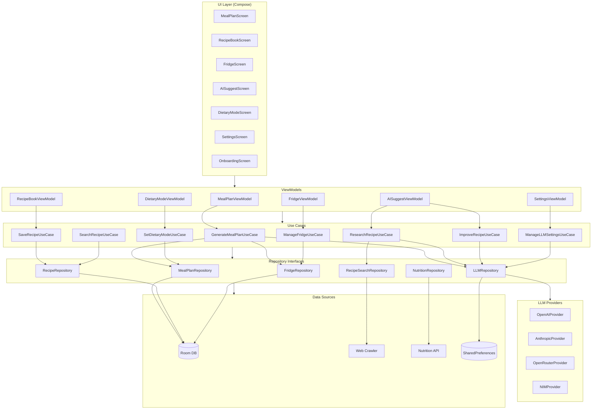
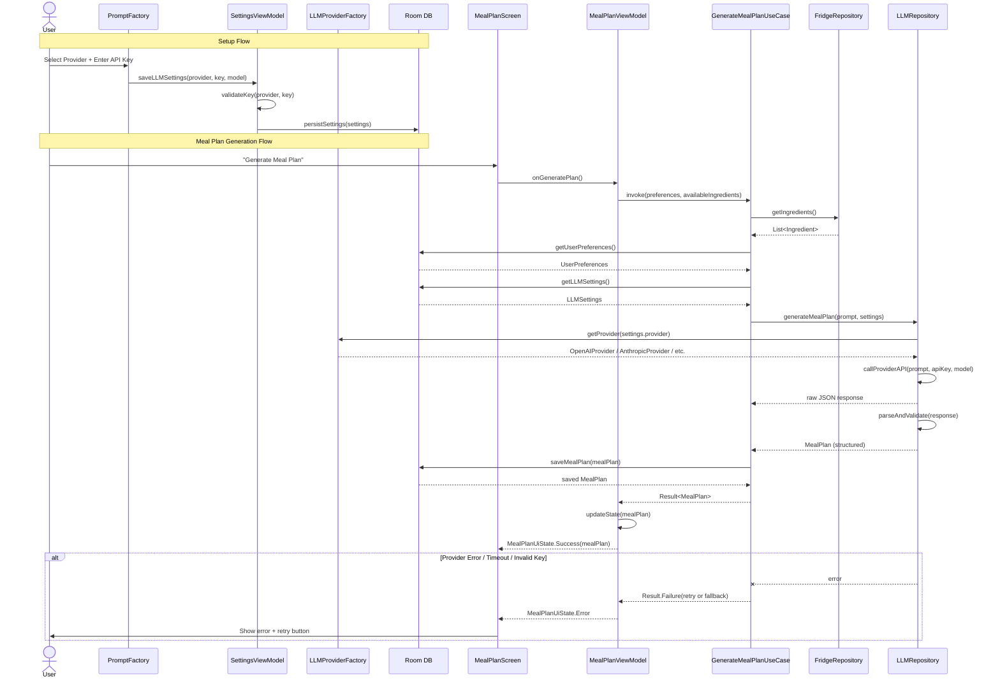
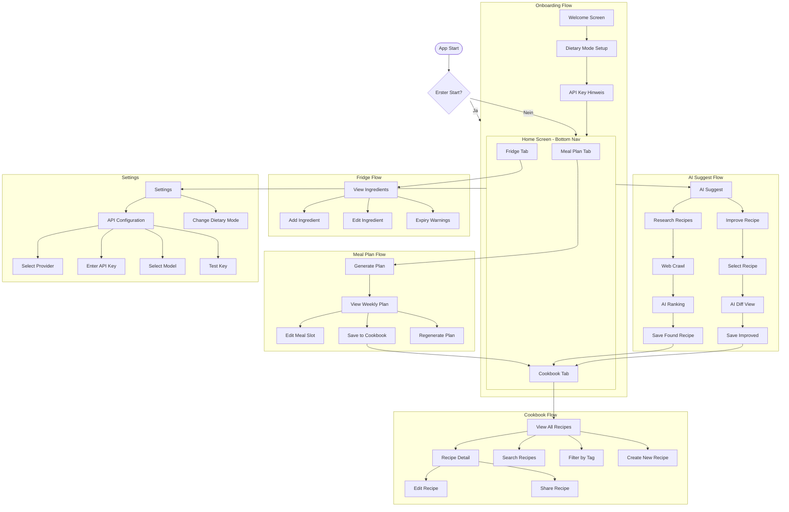

# MealMuse — Full Project Architecture

---

## Stage 1 — Product Definition

### Product Contract

| Decision | Choice | Rationale |
|---------|--------|-----------|
| **Target Platform** | Android 14+ (Kotlin/Jetpack Compose) | Modern UI framework |
| **AI Backend** | Multi-LLM: OpenAI, Anthropic, OpenRouter, NIM | User-configurable, private app |
| **Data Storage** | Room DB (local-first, no cloud) | Private app, no sync needed |
| **Authentication** | None | Private app, no accounts |
| **Offline Support** | Full CRUD (Recipes, Ingredients, Meal Plans) | Only AI features need network |
| **Recipe Sources** | Web Crawl (Custom Scraper) + AI Improvement | No external recipe API |
| **Min Target API** | Android 10 (API 29) | Broad coverage |
| **Build System** | Gradle (Kotlin DSL) | Android standard |
| **Price** | Free | Private use |
| **API Key Storage** | SharedPreferences | Simple, sufficient for private app |

### Features (v1.0)

```
┌─────────────────────────────────────────────────────────────────┐
│                        MealMuse v1.0                            │
├─────────────────────────────────────────────────────────────────┤
│                                                                  │
│  ┌─────────────────┐    ┌─────────────────┐    ┌──────────────┐ │
│  │  AI Meal Plan   │    │  Recipe Book    │    │  Fridge/     │ │
│  │  Generator      │    │  (CRUD + Tags)  │    │  Pantry      │ │
│  │                 │    │                 │    │              │ │
│  │  • Dietary Mode │    │  • Save/Edit    │    │  • Manual    │ │
│  │  • Nutrient Opt │    │  • Tagging      │    │  • Expiry    │ │
│  │  • Fridge-based │    │  • Search       │    │  • Category  │ │
│  └─────────────────┘    └─────────────────┘    └──────────────┘ │
│                                                                  │
│  ┌─────────────────┐    ┌─────────────────┐    ┌──────────────┐ │
│  │  AI Research    │    │  Dietary Modes  │    │  API Settings│ │
│  │  (Web Crawl)    │    │  (7 Presets)    │    │  (Multi-LLM) │ │
│  │                 │    │                 │    │              │ │
│  │  • Web Scraping │    │  • Keto         │    │  • OpenAI    │ │
│  │  • AI Improve   │    │  • Vegan        │    │  • Anthropic │ │
│  │  • Ranking      │    │  • Custom       │    │  • OpenRouter│ │
│  └─────────────────┘    └─────────────────┘    │  • NIM       │ │
│                                                 └──────────────┘ │
└─────────────────────────────────────────────────────────────────┘
```

---

## Stage 2 — System Architecture

### 2.1 — Architecture Overview



### 2.2 — Module Map

| Module | Responsibility | Key Classes | Dependencies |
|--------|---------------|-------------|--------------|
| `:app` | Entry point, DI graph, navigation | `MainActivity`, `AppNavGraph`, `MealMuseApp` | all feature modules |
| `:feature:meal-planner` | Weekly plan generation UI + logic | `MealPlanScreen`, `MealPlanViewModel`, `GenerateMealPlanUseCase` | `:domain`, `:data:ai`, `:data:local` |
| `:feature:recipe-book` | Saved recipe CRUD + search | `RecipeBookScreen`, `RecipeDetailScreen`, `RecipeBookViewModel`, `SaveRecipeUseCase` | `:domain`, `:data:local` |
| `:feature:fridge` | Ingredient inventory management | `FridgeScreen`, `FridgeViewModel`, `ManageFridgeUseCase` | `:domain`, `:data:local` |
| `:feature:ai-suggest` | Recipe research + improvement | `AISuggestScreen`, `AISuggestViewModel`, `ResearchRecipeUseCase`, `ImproveRecipeUseCase` | `:domain`, `:data:ai`, `:data:remote` |
| `:feature:preferences` | Dietary mode + nutrition goals | `PreferencesScreen`, `DietaryModeViewModel`, `SetDietaryModeUseCase` | `:domain`, `:data:local` |
| `:feature:settings` | API settings, provider config | `SettingsScreen`, `SettingsViewModel`, `ManageLLMSettingsUseCase` | `:domain`, `:data:ai` |
| `:domain` | Use cases, models, repository interfaces | `Recipe`, `MealPlan`, `UserPreferences`, `Ingredient`, `DietaryMode`, all `*UseCase`, all `*Repository` interfaces | none |
| `:data:local` | Room DB, DAOs, local data sources | `AppDatabase`, `RecipeDao`, `IngredientDao`, `MealPlanDao`, `PreferencesDao`, `RoomRecipeRepository` | `:domain` |
| `:data:ai` | Multi-LLM client, prompt builders, parsers | `LLMRepository`, `LLMProviderFactory`, `OpenAIProvider`, `AnthropicProvider`, `OpenRouterProvider`, `NIMProvider`, `PromptFactory`, `ResponseParser` | `:domain` |
| `:data:remote` | Web scraper, nutrition API | `WebRecipeSearchRepository`, `NutritionApiRepository` | `:domain` |
| `:core:ui` | Design system, shared composables, theme | `MealMuseTheme`, `RecipeCard`, `TagChip`, `MealSlot`, `EmptyState`, `LoadingSkeleton` | none |
| `:core:common` | Extensions, result types, coroutine utils | `Result<T>`, `FlowExtensions`, `DispatcherProvider`, `StringExtensions` | none |

### 2.3 — Data Model

```mermaid
erDiagram
    USER_PREFERENCES ||--o{ DIETARY_MODE_PIVOT : defines
    USER_PREFERENCES }o--|| DIETARY_MODE : "uses one"

    DIETARY_MODE {
        int id PK
        string name "Keto, Low-Carb, Vegetarian, Vegan, Paleo, Calorie-deficit, Custom"
        string description
        float maxCarbs
        float minProtein
        float maxCalories
        boolean isCustom
    }

    DIETARY_MODE_PIVOT {
        int id PK
        int preferencesId FK
        int dietaryModeId FK
    }

    MEAL_PLAN {
        string id PK
        string name
        date weekStart
        date weekEnd
        datetime createdAt
        string dietaryMode
    }

    MEAL_PLAN_ENTRY {
        string id PK
        string mealPlanId FK
        string recipeId FK
        string mealType "breakfast, lunch, dinner, snack"
        int dayOfWeek
        datetime scheduledAt
    }

    RECIPE {
        string id PK
        string name
        string description
        string instructions "JSON array of steps"
        int prepTimeMinutes
        int cookTimeMinutes
        int servings
        float calories
        float protein
        float carbs
        float fat
        string sourceUrl "nullable"
        string imageUrl
        datetime createdAt
        datetime updatedAt
        boolean isFavorite
    }

    RECIPE_INGREDIENT {
        string id PK
        string recipeId FK
        string ingredientName
        float amount
        string unit
        string notes
    }

    INGREDIENT {
        string id PK
        string name
        float quantity
        string unit
        date expiryDate "nullable"
        string category "produce, dairy, protein, pantry, frozen"
        datetime addedAt
    }

    TAG {
        string id PK
        string name
        string color "hex color"
    }

    RECIPE_TAG {
        string id PK
        string recipeId FK
        string tagId FK
    }

    AI_SESSION {
        string id PK
        string type "meal_plan, research, improvement"
        string prompt
        string response "raw JSON from LLM"
        string provider "openai, anthropic, openrouter, nim"
        datetime createdAt
        int tokenCount
    }

    LLM_SETTINGS {
        string id PK
        string provider "openai, anthropic, openrouter, nim"
        string apiKey "SharedPreferences"
        string model "gpt-4o, claude-sonnet, etc."
        boolean isActive
    }
```



### 2.4 — AI Integration Architecture (Multi-LLM)



### 2.5 — LLM Provider Architecture

```
┌─────────────────────────────────────────────────────────────────┐
│                    :data:ai Module                              │
├─────────────────────────────────────────────────────────────────┤
│                                                                  │
│  LLMRepository (Interface)                                      │
│       │                                                          │
│       ▼                                                          │
│  LLMProviderFactory                                             │
│       │                                                          │
│       ├── OpenAIProvider                                         │
│       │   ├── API: https://api.openai.com/v1/chat/completions  │
│       │   ├── Models: gpt-4o, gpt-4o-mini, gpt-3.5-turbo       │
│       │   └── Auth: Bearer {apiKey}                             │
│       │                                                          │
│       ├── AnthropicProvider                                      │
│       │   ├── API: https://api.anthropic.com/v1/messages        │
│       │   ├── Models: claude-sonnet-4-20250514, claude-3-5-sonnet │
│       │   └── Auth: x-api-key: {apiKey}                         │
│       │                                                          │
│       ├── OpenRouterProvider                                     │
│       │   ├── API: https://openrouter.ai/api/v1/chat/completions│
│       │   ├── Models: auto (via model routing)                  │
│       │   └── Auth: Bearer {apiKey}                             │
│       │                                                          │
│       └── NIMProvider                                            │
│           ├── API: {baseURL}/v1/chat/completions                │
│           ├── Models: nemotron-4-340b, llama-3.1-70b            │
│           └── Auth: Bearer {apiKey}                             │
│                                                                  │
│  ResponseParser ──▶ parseLLMResponse(provider, rawJSON)          │
│  PromptFactory ──▶ buildPrompt(type, params) → formatted prompt │
│                                                                  │
└─────────────────────────────────────────────────────────────────┘
```

---

## Stage 3 — Phase Plan

### Phase 0 — Project Scaffold

**Goal:** Leeres Android-Projekt kompiliert, alle Module existieren, Hilt DI-Graph läuft.

**Input:** Nothing (greenfield)

**Output:** Projekt läuft auf Emulator mit leerem Navigation-Graph

**Estimated complexity:** Medium

#### Subtasks

- [ ] 0.1 — Erstelle Root-`build.gradle.kts` mit Kotlin DSL, AGP 8.x, Compose-BOM, Hilt
- [ ] 0.2 — Erstelle `settings.gradle.kts` mit allen Moduleinträgen (14 Module)
- [ ] 0.3 — Erstelle `gradle.properties` mit Build-Flags
- [ ] 0.4 — Erstelle `:app` Modul mit `AndroidManifest.xml`, `MainActivity`, `MealMuseApp`
- [ ] 0.5 — Erstelle `:core:common` Modul mit `Result<T>` sealed class, `DispatcherProvider`, `FlowExtensions`
- [ ] 0.6 — Erstelle `:core:ui` Modul mit `MealMuseTheme`, `Typography`, `Colors`, leeren Composables
- [ ] 0.7 — Erstelle alle Feature-Module als leere Kotlin-Module mit gradle.build.kts
- [ ] 0.8 — Erstelle alle Data-Module als leere Kotlin-Module mit gradle.build.kts
- [ ] 0.9 — Erstelle `:domain` Modul mit allen Repository-Interfaces (leere Stubs) und leeren UseCases
- [ ] 0.10 — Erstelle `AppNavGraph` mit Navigation-Graph (ein leerer Scaffold pro Feature)
- [ ] 0.11 — Konfiguriere Hilt mit `@HiltAndroidApp` auf `MealMuseApp`, `@AndroidEntryPoint` auf `MainActivity`
- [ ] 0.12 — Erstelle Hilt-Module in `:data:local`, `:data:ai`, `:data:remote` (leere Provide-Methoden)
- [ ] 0.13 — Erstelle `.github/workflows/build.yml` mit Gradle-CI (build + lint)

#### Verification

- [ ] `./gradlew build` kompiliert ohne Fehler
- [ ] App startet auf Emulator und zeigt leere Navigation
- [ ] `./gradlew lint` läuft ohne Fehler

---

### Phase 1 — Data Layer (Room DB)

**Goal:** Room-Datenbank existiert, alle DAOs sind implementiert, Integration-Tests grün.

**Input:** Phase 0 complete

**Output:** Alle Datenstrukturen aus 2.3 sind speicherbar/querybar

**Estimated complexity:** Large

#### Subtasks

- [ ] 1.1 — Erstelle `AppDatabase` mit Room-Annotationen, Version 1, alle Entities registriert
- [ ] 1.2 — Erstelle `RecipeEntity` mit allen Feldern (id, name, description, instructions JSON, macros, etc.)
- [ ] 1.3 — Erstelle `IngredientEntity` (id, name, quantity, unit, expiryDate, category)
- [ ] 1.4 — Erstelle `MealPlanEntity` und `MealPlanEntryEntity`
- [ ] 1.5 — Erstelle `TagEntity` und `RecipeTagEntity` (many-to-many join table)
- [ ] 1.6 — Erstelle `UserPreferencesEntity` mit JSON-Field für DietaryModes
- [ ] 1.7 — Erstelle `AISessionEntity` (id, type, prompt, response, provider, tokenCount)
- [ ] 1.8 — Erstelle `RecipeDao` mit CRUD, Search (LIKE auf name), getByTag, getFavorites
- [ ] 1.9 — Erstelle `IngredientDao` mit CRUD, getByCategory, getByExpiryRange, searchByName
- [ ] 1.10 — Erstelle `MealPlanDao` mit CRUD, getByWeekRange, getByDate
- [ ] 1.11 — Erstelle `TagDao` mit CRUD, getRecipesByTag
- [ ] 1.12 — Erstelle `PreferencesDao` mit insert/update/get
- [ ] 1.13 — Erstelle `AISessionDao` mit insert, getByType, getLastN
- [ ] 1.14 — Erstelle Mapper-Extensions: Entity↔Domain für alle Models
- [ ] 1.15 — Erstelle Room-Migration Test (Schema-Export zu JSON, verify)
- [ ] 1.16 — Erstelle Integration-Tests für RecipeDao (CRUD + Search)
- [ ] 1.17 — Erstelle Integration-Tests für IngredientDao (CRUD + Expiry-Query)
- [ ] 1.18 — Erstelle Integration-Tests für MealPlanDao (CRUD + Week-Query)

#### Verification

- [ ] Alle DAO-Tests grün
- [ ] Schema-Export-Test grün
- [ ] Migration-Test für Version 1 grün

---

### Phase 2 — Domain Layer

**Goal:** Alle Use Cases sind implementiert, Repository-Interfaces vollständig.

**Input:** Phase 1 complete

**Output:** Domain Layer enthält alle Geschäftslogik-Interfaces und Use Cases

**Estimated complexity:** Medium

#### Subtasks

- [ ] 2.1 — Erstelle `Recipe` Domain-Model (Value Object, immutable)
- [ ] 2.2 — Erstelle `Ingredient` Domain-Model
- [ ] 2.3 — Erstelle `MealPlan` und `MealPlanEntry` Domain-Models
- [ ] 2.4 — Erstelle `UserPreferences` Domain-Model mit `DietaryMode` sealed class
- [ ] 2.5 — Erstelle `Tag` Domain-Model
- [ ] 2.6 — Erstelle `AISession` Domain-Model
- [ ] 2.7 — Erstelle `LLMSettings` Domain-Model (provider, apiKey, model, isActive)
- [ ] 2.8 — Definiere `MealPlanRepository` Interface
- [ ] 2.9 — Definiere `RecipeRepository` Interface
- [ ] 2.10 — Definiere `FridgeRepository` Interface
- [ ] 2.11 — Definiere `LLMRepository` Interface (generateMealPlan, researchRecipes, improveRecipe, validateKey)
- [ ] 2.12 — Definiere `RecipeSearchRepository` Interface
- [ ] 2.13 — Definiere `NutritionRepository` Interface
- [ ] 2.14 — Implementiere `GenerateMealPlanUseCase`
- [ ] 2.15 — Implementiere `SaveRecipeUseCase`
- [ ] 2.16 — Implementiere `SearchRecipeUseCase`
- [ ] 2.17 — Implementiere `ManageFridgeUseCase`
- [ ] 2.18 — Implementiere `ResearchRecipeUseCase`
- [ ] 2.19 — Implementiere `ImproveRecipeUseCase`
- [ ] 2.20 — Implementiere `SetDietaryModeUseCase`
- [ ] 2.21 — Implementiere `ManageLLMSettingsUseCase` (save, validate, get, switch)
- [ ] 2.22 — Erstelle Unit-Tests für alle Use Cases mit Mock-Repositories

#### Verification

- [ ] Alle Use Case Unit-Tests grün
- [ ] Alle Repository-Interfaces dokumentiert mit KDoc

---

### Phase 3 — AI Integration (Multi-LLM)

**Goal:** Multi-LLM Support funktioniert, alle Provider antworten korrekt.

**Input:** Phase 2 complete

**Output:** LLMRepository implementiert, alle 4 Provider testbar

**Estimated complexity:** Large

#### Subtasks

- [ ] 3.1 — Erstelle `LLMConfig` (Base-URLs, Timeouts, Retry-Config pro Provider)
- [ ] 3.2 — Erstelle `LLMProvider` Interface (generateContent(prompt, apiKey, model) → Response)
- [ ] 3.3 — Erstelle `OpenAIProvider` (OpenAI Chat Completions API, Bearer Auth)
- [ ] 3.4 — Erstelle `AnthropicProvider` (Anthropic Messages API, x-api-key Auth)
- [ ] 3.5 — Erstelle `OpenRouterProvider` (OpenRouter Chat Completions API, Bearer Auth)
- [ ] 3.6 — Erstelle `NIMProvider` (NVIDIA NIM API, Bearer Auth, configurable Base-URL)
- [ ] 3.7 — Erstelle `LLMProviderFactory` (Provider aus Settings laden → richtige Provider-Instanz)
- [ ] 3.8 — Erstelle `PromptFactory` mit 3 Prompt-Buildern (MealPlan, Research, Improvement)
- [ ] 3.9 — Erstelle `ResponseParser` (JSON → Domain Objects, mit provider-spezifischem Parsing)
- [ ] 3.10 — Erstelle `MealPlanParser` (JSON → MealPlan)
- [ ] 3.11 — Erstelle `RecipeResearchParser` (JSON → List<Recipe>)
- [ ] 3.12 — Erstelle `RecipeImprovementParser` (JSON → RecipeImprovement)
- [ ] 3.13 — Implementiere `LLMRepository` (Klasse die Interface implementiert)
- [ ] 3.14 — Implementiere Retry-Logic mit Exponential Backoff (max 3 retries)
- [ ] 3.15 — Implementiere Error-Handling (Network, Timeout, Parse-Error, Invalid Key)
- [ ] 3.16 — Erstelle `LLMKeyValidator` (Teste Key mit minimalem API-Call)
- [ ] 3.17 — Erstelle Unit-Tests für PromptFactory
- [ ] 3.18 — Erstelle Unit-Tests für ResponseParser (jeder Provider)
- [ ] 3.19 — Erstelle Integration-Tests für LLMProviderFactory (Mock-HTTP)
- [ ] 3.20 — Erstelle Integration-Tests für LLMRepository (Mock-Providers)

#### Verification

- [ ] Alle Parser-Tests grün
- [ ] Alle Integration-Tests grün
- [ ] Manuell testbar: Jeder Provider antwortet korrekt im Emulator

---

### Phase 4 — Fridge Module

**Goal:** Fridge-Feature vollständig: CRUD, Kategorie-Filter, Ablaufwarnung.

**Input:** Phase 3 complete

**Output:** Fridge-Funktionalität UI-testbar

**Estimated complexity:** Medium

#### Subtasks

- [ ] 4.1 — Erstelle `FridgeScreen` mit Compose (Liste + FAB zum Hinzufügen)
- [ ] 4.2 — Erstelle `FridgeViewModel` mit StateFlow<List<Ingredient>>
- [ ] 4.3 — Erstelle `AddIngredientSheet` (Bottom Sheet: Name, Menge, Einheit, Kategorie, Ablaufdatum)
- [ ] 4.4 — Erstelle `EditIngredientSheet`
- [ ] 4.5 — Erstelle `FridgeFilters` (Filter nach Kategorie, Ablaufdatum)
- [ ] 4.6 — Implementiere `ManageFridgeUseCase` Integration in ViewModel
- [ ] 4.7 — Erstelle Ablauf-Badge (rote Warnung wenn Ablauf < 3 Tage)
- [ ] 4.8 — Erstelle Leere-State-Composable
- [ ] 4.9 — Erstelle Swipe-to-Delete mit Undo-Snackbar
- [ ] 4.10 — Erstelle Search-Bar für Zutaten-Suche
- [ ] 4.11 — Erstelle Unit-Tests für ManageFridgeUseCase
- [ ] 4.12 — Erstelle UI-Tests

#### Verification

- [ ] Alle CRUD-Operationen im UI testbar
- [ ] Leere-State zeigt korrekt
- [ ] Swipe-to-Delete funktioniert mit Undo
- [ ] Ablauf-Warnung zeigt bei Zutaten < 3 Tage

---

### Phase 5 — Meal Planner Module

**Goal:** Wöchentlicher Meal-Plan wird durch KI generiert, basierend auf Präferenzen + Zutaten.

**Input:** Phase 4 complete

**Output:** Meal Plan Generation → Save → Display funktioniert end-to-end

**Estimated complexity:** Large

#### Subtasks

- [ ] 5.1 — Erstelle `MealPlanScreen` (Wochenansicht, 7 Tage × 4 Mahlzeiten)
- [ ] 5.2 — Erstelle `MealPlanViewModel` mit StateFlow<MealPlanUiState>
- [ ] 5.3 — Erstelle `GenerateMealPlanButton` (Loading-Indicator)
- [ ] 5.4 — Erstelle `MealSlotComposable` (Karte mit Recipe-Thumbnail)
- [ ] 5.5 — Erstelle `MealPlanWeekSelector` (Navigation zwischen Wochen)
- [ ] 5.6 — Implementiere `GenerateMealPlanUseCase` Integration
- [ ] 5.7 — Erstelle Meal Plan Persistence (speichert nach Generation)
- [ ] 5.8 — Erstelle Meal Plan Display (liest gespeicherte Pläne)
- [ ] 5.9 — Erstelle Meal Plan Edit (Mahlzeit austauschen)
- [ ] 5.10 — Erstelle Loading-Animation (Shimmer) während AI-Generation
- [ ] 5.11 — Erstelle Error-State mit Retry-Button
- [ ] 5.12 — Erstelle Unit-Tests für GenerateMealPlanUseCase
- [ ] 5.13 — Erstelle UI-Tests

#### Verification

- [ ] "Generate" → Spinner → Plan zeigt
- [ ] Plan wird nach Generation persistiert
- [ ] Woche-Wechsel zeigt korrekten Plan
- [ ] Error-Case mit Retry funktioniert

---

### Phase 6 — Recipe Book Module

**Goal:** Rezepte können gespeichert, bearbeitet, gelöscht, getaggt und durchsucht werden.

**Input:** Phase 5 complete

**Output:** Recipe Book CRUD + Search funktioniert

**Estimated complexity:** Medium

#### Subtasks

- [ ] 6.1 — Erstelle `RecipeBookScreen` mit Grid-Layout (2 Spalten)
- [ ] 6.2 — Erstelle `RecipeBookViewModel` mit StateFlow<List<Recipe>>
- [ ] 6.3 — Erstelle `RecipeDetailScreen`
- [ ] 6.4 — Erstelle `EditRecipeScreen`
- [ ] 6.5 — Erstelle `CreateRecipeScreen`
- [ ] 6.6 — Erstelle `TagFilterBar` (Horizontal-Scroll, Multi-Select)
- [ ] 6.7 — Erstelle `RecipeSearchBar` mit Debounce
- [ ] 6.8 — Erstelle `FavoriteToggle` (Herz-Icon mit Animation)
- [ ] 6.9 — Implementiere `SaveRecipeUseCase` Integration
- [ ] 6.10 — Implementiere `SearchRecipeUseCase` Integration
- [ ] 6.11 — Erstelle Recipe-Import von Meal Plan ("Save to Cookbook")
- [ ] 6.12 — Erstelle Leere-State
- [ ] 6.13 — Erstelle Swipe-to-Delete für Rezepte
- [ ] 6.14 — Erstelle Unit-Tests
- [ ] 6.15 — Erstelle UI-Tests

#### Verification

- [ ] Rezept erstellen → zeigt in Grid
- [ ] Rezept bearbeiten → Änderungen persistiert
- [ ] Search + Tag Filter funktionieren
- [ ] Swipe-to-Delete mit Undo

---

### Phase 7 — AI Suggest Module

**Goal:** Web-Crawl + AI-Verbesserung funktioniert.

**Input:** Phase 6 complete

**Output:** Recipe Research + Improvement Feature nutzbar

**Estimated complexity:** Large

#### Subtasks

- [ ] 7.1 — Erstelle `AISuggestScreen` mit 2 Tabs: "Research" und "Improve"
- [ ] 7.2 — Erstelle `AISuggestViewModel` mit StateFlow<AISuggestUiState>
- [ ] 7.3 — Erstelle `ResearchSearchBar`
- [ ] 7.4 — Erstelle `ResearchResultCard` mit "Save to Cookbook" Button
- [ ] 7.5 — Erstelle `ImproveRecipeSelector`
- [ ] 7.6 — Erstelle `ImprovementDiff` (Vorher/Nachher-Vergleich)
- [ ] 7.7 — Implementiere `ResearchRecipeUseCase` Integration
- [ ] 7.8 — Implementiere `ImproveRecipeUseCase` Integration
- [ ] 7.9 — Erstelle Web-Scraper (OkHttp + Jsoup) für Recipe-URLs
- [ ] 7.10 — Erstelle Ranking-Logik (AI score recipes by relevance)
- [ ] 7.11 — Erstelle Leere-State + Loading-Animation
- [ ] 7.12 — Erstelle Unit-Tests
- [ ] 7.13 — Erstelle UI-Tests

#### Verification

- [ ] "Search" → Web-Ergebnisse → AI-Ranking → Liste
- [ ] "Improve" → Vergleich zeigt Vorher/Nachher
- [ ] "Save to Cookbook" speichert verbessertes Rezept

---

### Phase 8 — Dietary Modes

**Goal:** 7 Presets + Custom Modus, gespeichert in Preferences.

**Input:** Phase 7 complete

**Output:** Dietary Mode Selection + Filtering funktionstüchtig

**Estimated complexity:** Small

#### Subtasks

- [ ] 8.1 — Erstelle `PreferencesScreen` mit DietaryMode-Selector (ChipGroup)
- [ ] 8.2 — Erstelle `DietaryModeViewModel` mit StateFlow<UserPreferences>
- [ ] 8.3 — Implementiere `SetDietaryModeUseCase`
- [ ] 8.4 — Erstelle `CustomModeBuilder` (Eigene Makro-Grenzen setzen)
- [ ] 8.5 — Erstelle DietaryMode Presets (Keto, Low-Carb, Vegetarian, Vegan, Paleo, Calorie-deficit)
- [ ] 8.6 — Integriere DietaryMode in Meal Plan Generation
- [ ] 8.7 — Erstelle UI-Tests

#### Verification

- [ ] Modus-Auswahl → persistiert → Meal Plan respektiert Modus
- [ ] Custom Mode → eigene Limits → Plan respektiert Limits

---

### Phase 9 — API Settings (Multi-LLM)

**Goal:** User kann API-Key eingeben, Provider wählen, Key wird validiert.

**Input:** Phase 8 complete

**Output:** Settings-Screen mit vollständiger LLM-Konfiguration

**Estimated complexity:** Medium

#### Subtasks

- [ ] 9.1 — Erstelle `SettingsScreen` mit Provider-Dropdown (OpenAI, Anthropic, OpenRouter, NIM)
- [ ] 9.2 — Erstelle `SettingsViewModel` mit StateFlow<LLMSettings>
- [ ] 9.3 — Erstelle `ApiKeyInput` (Maskiertes Textfeld mit Show/Hide Toggle)
- [ ] 9.4 — Erstelle `ModelSelector` (Dropdown, auto-populated basierend auf Provider)
- [ ] 9.5 — Erstelle `ApiKeyValidator` (Testet Key mit minimalem API-Call)
- [ ] 9.6 — Implementiere `ManageLLMSettingsUseCase` Integration
- [ ] 9.7 — Erstelle API-Key Speicherung in SharedPreferences (verschlüsselt optional)
- [ ] 9.8 — Erstelle "Test Key" Button (validiert Key + zeigt Erfolg/Fehler)
- [ ] 9.9 — Erstelle Provider-spezifische Base-URL Eingabe (für NIM / Self-hosted)
- [ ] 9.10 — Erstelle Error-Handling (Invalid Key, Network Error, Rate Limit)
- [ ] 9.11 — Erstelle Unit-Tests für ManageLLMSettingsUseCase
- [ ] 9.12 — Erstelle UI-Tests

#### Verification

- [ ] Provider auswählen → Key eingeben → "Test" → Erfolg/Fehler
- [ ] Model-Dropdown zeigt korrekte Modelle für Provider
- [ ] Key wird in SharedPreferences gespeichert
- [ ] Invalid Key zeigt Fehlermeldung

---

### Phase 10 — Core UI & Design System

**Goal:** Einheitliches Design, Dark Mode, responsive Komponenten.

**Input:** Phase 9 complete

**Output:** `:core:ui` enthält vollständige Design-System

**Estimated complexity:** Medium

#### Subtasks

- [ ] 10.1 — Definiere `MealMuseTheme` mit Light + Dark Palette
- [ ] 10.2 — Definiere `Typography`
- [ ] 10.3 — Erstelle `RecipeCard`
- [ ] 10.4 — Erstelle `MealSlot`
- [ ] 10.5 — Erstelle `IngredientChip`
- [ ] 10.6 — Erstelle `TagChip`
- [ ] 10.7 — Erstelle `EmptyState`
- [ ] 10.8 — Erstelle `LoadingSkeleton`
- [ ] 10.9 — Erstelle `ErrorCard`
- [ ] 10.10 — Erstelle `BottomNavigation` (3 Tabs: Meal Plan, Cookbook, Fridge)
- [ ] 10.11 — Erstelle `TopAppBar`
- [ ] 10.12 — Erstelle `FAB`
- [ ] 10.13 — Erstelle Compose Previews für alle Komponenten

#### Verification

- [ ] Alle Previews rendern in Light + Dark
- [ ] Bottom Navigation wechselt korrekt

---

### Phase 11 — Polish & Integration

**Goal:** Onboarding, Empty States, Error States, Offline-Handling vollständig.

**Input:** Phase 10 complete

**Output:** App ist feature-complete und UI-polished

**Estimated complexity:** Medium

#### Subtasks

- [ ] 11.1 — Erstelle `OnboardingScreen` (Welcome → Dietary Setup → API Key Hinweis)
- [ ] 11.2 — Erstelle `OnboardingFlow`
- [ ] 11.3 — Erstelle Empty States für alle Screens
- [ ] 11.4 — Erstelle Error States für alle Screens
- [ ] 11.5 — Erstelle Offline-Indicator (Snackbar wenn kein Netz)
- [ ] 11.6 — Erstelle Deep-Links für Rezepte (meal://recipe/{id})
- [ ] 11.7 — Erstelle Share-Feature (Recipe als Text/Link teilen)
- [ ] 11.8 — Erstelle Settings-Screen (Dietary Mode, API Settings, About)
- [ ] 11.9 — Erstelle App-Icon
- [ ] 11.10 — Erstelle SplashScreen

#### Verification

- [ ] Onboarding zeigt beim ersten Start
- [ ] Empty States zeigen bei leerem Zustand
- [ ] Offline-Modus zeigt Snackbar

---

### Phase 12 — Testing & Release Prep

**Goal:** Alle Tests grün, App ist Release-ready.

**Input:** Phase 11 complete

**Output:** Release-Build APK, Test-Report

**Estimated complexity:** Medium

#### Subtasks

- [ ] 12.1 — Unit-Tests für alle Use Cases (falls fehlend)
- [ ] 12.2 — Integration-Tests für Room + DAOs (falls fehlend)
- [ ] 12.3 — UI-Tests für alle Screens
- [ ] 12.4 — End-to-End Tests (Meal Gen → Save → Display)
- [ ] 12.5 — Linter-Check (ktlint + detekt)
- [ ] 12.6 — Release-Config (keystore, signing, ProGuard/R8)
- [ ] 12.7 — APK/AAB mit Release-Build
- [ ] 12.8 — README.md

#### Verification

- [ ] `./gradlew test` grün
- [ ] `./gradlew connectedTest` grün
- [ ] Lint-Check grün
- [ ] Release-APK installiert und läuft

---

## Stage 4 — Documentation Package

### 4.1 — User Journey Flowchart



### 4.2 — AI Prompt Design

| Feature | System Prompt Summary | User Prompt Template | Expected Output Schema |
|---------|----------------------|---------------------|----------------------|
| **Meal Plan Generation** | "Du bist ein professioneller Ernährungsberater und Koch. Erstelle strukturierte Wochenpläne." | "Erstelle einen 7-Tage Meal Plan. Dietary Mode: {mode}. Verfügbare Zutaten: {ingredients}. Max Kalorien/Tag: {maxCalories}. Protein-Min: {minProtein}g. Carb-Max: {maxCarbs}g." | JSON: `{ "mealPlan": { "days": [ { "day": 1, "breakfast": { "recipe": {...} }, "lunch": {...}, "dinner": {...}, "snack": {...} } ] } }` |
| **Recipe Research** | "Du bist ein Rezept-Experte. Analysiere gefundene Rezepte, bewerte sie." | "Bewerte dieses Rezept: {recipeJson}. Ernährungsziele: {goals}. Verfügbare Zutaten: {ingredients}. Schlage 3 Verbesserungen vor." | JSON: `{ "score": 85, "improvements": ["..."], "suggestedSubstitutions": [{"original":"...", "replacement":"..."}] }` |
| **Recipe Improvement** | "Du bist ein Kochbuch-Autor. Verbessere Rezepte." | "Verbessere dieses Rezept: {recipeJson}. Fokus: {focus}. Dietary Constraints: {constraints}." | JSON: `{ "improvedRecipe": { "name": "...", "instructions": [...], "ingredients": [...], "macros": {...} }, "changes": [{"field":"...", "old":"...", "new":"..."}] }` |

### 4.3 — Tech Stack Summary

| Layer | Technology | Rationale |
|-------|-----------|-----------|
| **UI** | Jetpack Compose | Declaratives UI-Framework, modern |
| **State** | MVVM + StateFlow/SharedFlow | Reactive State-Management |
| **DI** | Hilt | Standard für Android |
| **DB** | Room (SQLite) | Offline-first, type-safe |
| **AI** | Multi-LLM (OpenAI, Anthropic, OpenRouter, NIM) | User-configurable, privat |
| **Web Scraping** | OkHttp + Jsoup | Leichtgewichtig für HTML-Parsing |
| **Navigation** | Compose Navigation | Einheitlich mit Compose |
| **Testing** | JUnit5 + Turbine + Compose Test | Unit + Flow + UI Coverage |
| **Build** | Gradle (Kotlin DSL) | Android Standard |
| **Min SDK** | 29 (Android 10) | ~95% der Nutzer |
| **API Keys** | SharedPreferences | Einfach, privat |

### 4.4 — Open Questions

| # | Frage | Empfohlene Default | Blockiert Phase? |
|---|-------|-------------------|-----------------|
| 1 | **Soll die App Notifications senden?** | Ja (Ablaufwarnung) | Nein |
| 2 | **Soll NIM lokal laufen (Ollama) oder Remote?** | Remote (API) | Nein |
| 3 | **Soll "Improve Recipe" auch eigene Prompts erlauben?** | Ja (Custom Focus) | Nein |
| 4 | **Soll Bilder-Generierung für Rezepte existieren?** | Nein (v1.0) | Nein |
| 5 | **Soll die App Wear OS unterstützen?** | Nein (v1.0) | Nein |

---

### Appendix — Future Enhancements (v2.0+)

- **Barcode Scanner** — Kamera-Scan für Zutatenerkennung
- **Smart Watch Integration** — Wear OS App
- **Voice Cooking** — Sprachassistent für Kochschritte
- **NLP Einkaufsliste** — Automatisch aus Meal Plan
- **Waste Tracker** — Lebensmittelverschwendung verfolgen
- **Social Recipes** — Rezepte teilen und bewerten
- **Image Generation** — Rezept-Bilder via DALL-E / Midjourney
