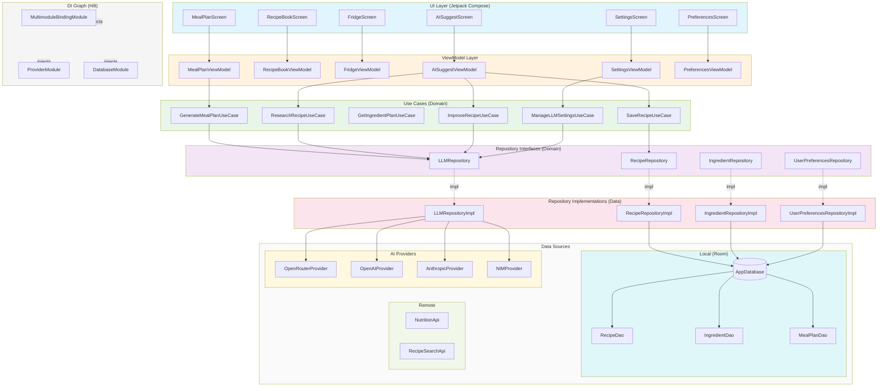
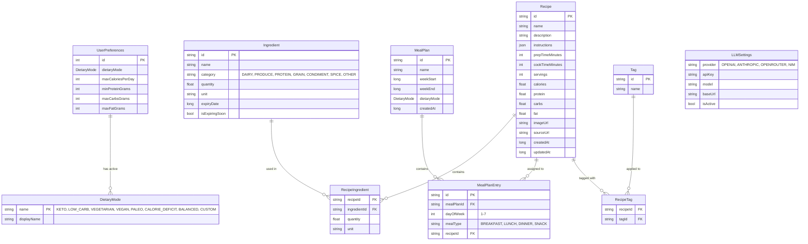
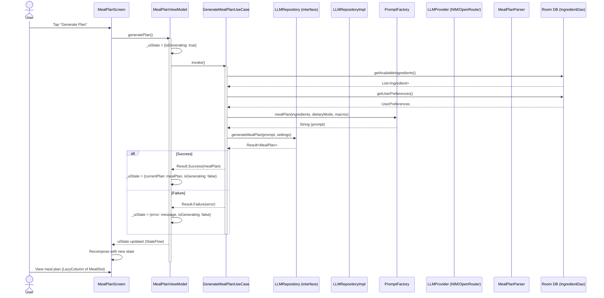
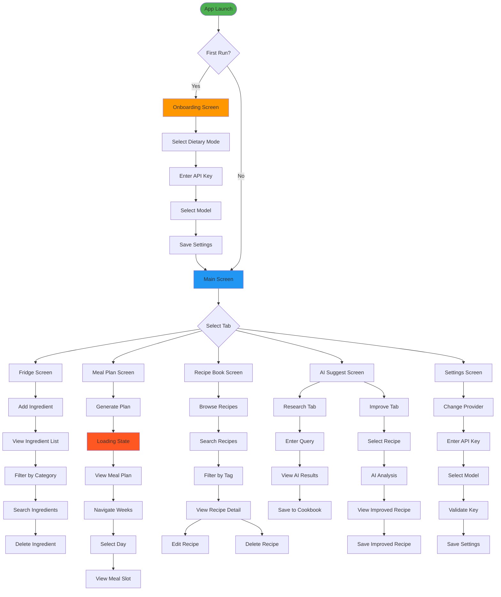

# MealMuse — Complete Project Plan

---

## Stage 1 — Product Definition

### Product Contract

**Product:** MealMuse — AI-powered Android meal planning app

**Target platform:** Android 8+ (API 26+), Kotlin, Jetpack Compose

**Primary AI backend:** Multi-provider cloud LLM — NVIDIA NIM (meta/llama-3.1-70b-instruct as primary), with fallback to OpenRouter (free tier models), OpenAI (gpt-4o-mini), Anthropic (Claude 3.5 Sonnet). No on-device inference. API keys stored locally in SharedPreferences (private app, single user).

**Data storage:** Local-first (Room DB). No cloud sync. No backend server. Single-device only.

**Authentication:** None. Guest mode only. No account system.

**Offline support:**
| Feature | Offline | Notes |
|---------|---------|-------|
| Browse saved recipes | ✅ | Fully offline |
| View existing meal plans | ✅ | Fully offline |
| Manage fridge/pantry | ✅ | Fully offline |
| Dietary preferences | ✅ | Stored locally |
| Generate new meal plan | ❌ | Requires AI API call |
| Recipe research | ❌ | Requires AI API call |
| Recipe improvement | ❌ | Requires AI API call |

**Core feature set (matching codebase):**
1. **AI Meal Planning** — Generate weekly plan from dietary preferences, nutritional macros, available ingredients
2. **Dietary Modes** — Keto, Low-Carb, Vegetarian, Vegan, Paleo, Calorie-deficit, Custom
3. **Recipe Cookbook** — Save, edit, delete recipes. Tag and search.
4. **AI Recipe Research** — Query AI for recipes matching criteria, rank by relevance
5. **AI Recipe Improvement** — Analyze saved recipe, suggest improvements (health/taste/efficiency)
6. **Fridge/Pantry** — Ingredient inventory with categories, quantities, expiry tracking

---

## Stage 2 — System Architecture

### 2.1 Architecture Overview



### 2.2 Module Map

| Module | Responsibility | Key Classes | Dependencies |
|--------|---------------|-------------|--------------|
| `:app` | Entry point, DI graph, navigation | `MainActivity`, `AppNavGraph`, `MealMuseApp` | all feature modules |
| `:feature:meal-planner` | Weekly plan generation + display | `MealPlanScreen`, `MealPlanViewModel` | `:domain`, `:core:ui` |
| `:feature:recipe-book` | Saved recipe CRUD + search | `RecipeBookScreen`, `RecipeBookViewModel` | `:domain`, `:core:ui` |
| `:feature:fridge` | Ingredient inventory management | `FridgeScreen`, `FridgeViewModel` | `:domain`, `:core:ui` |
| `:feature:ai-suggest` | Recipe research + improvement | `AISuggestScreen`, `AISuggestViewModel` | `:domain`, `:core:ui` |
| `:feature:settings` | LLM provider/model config | `SettingsScreen`, `SettingsViewModel` | `:domain`, `:core:ui` |
| `:feature:preferences` | Dietary goals & macros | `PreferencesScreen`, `PreferencesViewModel` | `:domain`, `:core:ui` |
| `:feature:onboarding` | First-run setup | `OnboardingScreen`, `OnboardingViewModel` | `:domain`, `:core:ui` |
| `:domain` | Use cases, models, repo interfaces | `*UseCase`, `Recipe`, `MealPlan`, `LLMSettings`, `Ingredient`, `*Repository` | none |
| `:data:local` | Room DB, DAOs, mappers | `AppDatabase`, `*Dao`, `*Entity`, `*Mapper` | `:domain` |
| `:data:ai` | AI providers, prompt factory, parsers | `*Provider`, `LLMProviderFactory`, `PromptFactory`, `MealPlanParser` | `:domain` |
| `:data:remote` | HTTP clients, nutrition/search APIs | `NutritionApiService`, `RecipeSearchService` | `:domain` |
| `:core:ui` | Theme, shared composables | `MealMuseTheme`, `RecipeCard`, `MealSlot`, `EmptyState`, `ErrorCard` | none |
| `:core:common` | Result type, extensions, utils | `Result<T>`, `suspendResult`, `*Extensions` | none |

### 2.3 Data Model



### 2.4 AI Integration Architecture



---

## Stage 3 — Phase Plan (Agent-Executable)

### Phase 0 — Project Scaffold

**Goal:** Gradle multi-module project compiles, runs, and navigates between empty screens.

**Input:** None (greenfield)

**Output:** Working empty Android app with 15 modules, Hilt DI, navigation graph, basic theme.

**Estimated complexity:** Large

#### Subtasks
- [ ] 0.1 — Create root `build.gradle.kts` with AGP 8.2.2, Kotlin 1.9.22, Compose BOM 2024.02.00
- [ ] 0.2 — Create `settings.gradle.kts` with all 15 modules declared
- [ ] 0.3 — Create `:core:common` module with `Result<T>` sealed class (Success, Failure, Loading)
- [ ] 0.4 — Create `:core:ui` module with `MealMuseTheme`, shared `Colors`, `Typography`
- [ ] 0.5 — Create `:domain` module with placeholder model classes (`Recipe`, `MealPlan`, `Ingredient`)
- [ ] 0.6 — Create `:data:local` module with Room config and empty `AppDatabase`
- [ ] 0.7 — Create `:data:ai` module with `LLMProvider` interface and empty `LLMRepository`
- [ ] 0.8 — Create `:data:remote` module with Retrofit config
- [ ] 0.9 — Create 8 feature modules, each with empty `Screen` composable and `ViewModel`
- [ ] 0.10 — Create `:app` module with `MainActivity`, `AppNavGraph`, Hilt `@AndroidEntryPoint`
- [ ] 0.11 — Wire Hilt `@Module`/`@InstallIn` for all provider/repo bindings
- [ ] 0.12 — Run `./gradlew assembleDebug` — verify clean build

#### Verification
- [ ] `./gradlew assembleDebug` passes with zero errors
- [ ] APK installs and launches on emulator
- [ ] Navigation works between all feature screens

---

### Phase 1 — Data Layer (Room DB + Local Sources)

**Goal:** Room database creates all tables, all DAOs pass basic CRUD tests, mappers convert entity ↔ domain.

**Input:** Phase 0 complete (empty modules exist)

**Output:** Working Room DB with 6 tables, 6 DAOs, entity-to-domain mappers, test suite passing.

**Estimated complexity:** Large

#### Subtasks
- [ ] 1.1 — Create `RecipeEntity` with all fields (id, name, description, instructions JSON, macros, timestamps)
- [ ] 1.2 — Create `IngredientEntity` with all fields (id, name, category, quantity, unit, expiryDate)
- [ ] 1.3 — Create `MealPlanEntity` (id, name, weekStart, weekEnd, dietaryMode, createdAt)
- [ ] 1.4 — Create `MealPlanEntryEntity` (id, mealPlanId, dayOfWeek, mealType, recipeId)
- [ ] 1.5 — Create `TagEntity` (id, name) and `RecipeTagEntity` (recipeId, tagId) — junction table
- [ ] 1.6 — Create `UserPreferencesEntity` (dietaryMode, maxCalories, minProtein, maxCarbs, maxFat)
- [ ] 1.7 — Create `AppDatabase` extending `RoomDatabase` with all 7 entities registered
- [ ] 1.8 — Create `RecipeDao` with insert, getById, getAll, search, delete, getByTag
- [ ] 1.9 — Create `IngredientDao` with insert, getById, getAll, getByCategory, delete, getExpiringSoon
- [ ] 1.10 — Create `MealPlanDao` with insert, getById, getLatest, delete
- [ ] 1.11 — Create `MealPlanEntryDao` with insertAll, getByPlanAndDay, deleteByPlan
- [ ] 1.12 — Create `TagDao` with insert, getAll, getRecipesByTag
- [ ] 1.13 — Create `UserPreferencesDao` with get, insert (single-row)
- [ ] 1.14 — Create `RecipeMapper` (entity ↔ domain, JSON instructions ↔ List<String>)
- [ ] 1.15 — Create `IngredientMapper` (entity ↔ domain, category enum mapping)
- [ ] 1.16 — Create `MealPlanMapper` with entry aggregation
- [ ] 1.17 — Create `RecipeDaoTest` with Room in-memory DB (insert, retrieve, search, delete)
- [ ] 1.18 — Create `IngredientDaoTest` with expiry date filtering
- [ ] 1.19 — Create `MealPlanDaoTest` with cascade delete of entries

#### Verification
- [ ] All DAO tests pass: `./gradlew :data:local:test`
- [ ] Database creates without migration errors on fresh install
- [ ] Mappers produce identical objects round-trip (entity → domain → entity)

---

### Phase 2 — Domain Layer (Use Cases + Repository Interfaces)

**Goal:** All use cases implemented, all repository interfaces defined, no concrete implementations yet.

**Input:** Phase 1 complete (domain models, entities, DAOs exist)

**Output:** 8 use cases, 4 repository interfaces, all compile and pass unit tests with mock repos.

**Estimated complexity:** Medium

#### Subtasks
- [ ] 2.1 — Define `LLMRepository` interface: `generateMealPlan(prompt, settings)`, `researchRecipes(prompt, settings)`, `improveRecipe(prompt, settings)`, `validateApiKey(provider, key)`, `getLLMSettings()`, `saveLLMSettings(settings)`
- [ ] 2.2 — Define `RecipeRepository` interface: `saveRecipe(recipe)`, `getRecipeById(id)`, `getAllRecipes()`, `searchRecipes(query)`, `deleteRecipe(id)`, `getRecipesByTag(tagId)`
- [ ] 2.3 — Define `IngredientRepository` interface: `addIngredient(ingredient)`, `getAllIngredients()`, `getByCategory(category)`, `deleteIngredient(id)`, `getExpiringSoon()`
- [ ] 2.4 — Define `UserPreferencesRepository` interface: `getPreferences()`, `savePreferences(prefs)`
- [ ] 2.5 — Create `GenerateMealPlanUseCase`: fetch ingredients + prefs → build prompt → call repo → return plan
- [ ] 2.6 — Create `ResearchRecipeUseCase`: query string → prompt → repo → return List<Recipe>
- [ ] 2.7 — Create `ImproveRecipeUseCase`: recipe + focus → prompt → repo → return RecipeImprovement
- [ ] 2.8 — Create `SaveRecipeUseCase`: recipe → validate → repo → return Unit
- [ ] 2.9 — Create `ManageLLMSettingsUseCase`: getSettings, saveSettings, validateKey, switchProvider, getModelsForProvider
- [ ] 2.10 — Create `ManageIngredientsUseCase`: add, delete, filter, getExpiring
- [ ] 2.11 — Create `ManageRecipesUseCase`: save, delete, search, getByTag
- [ ] 2.12 — Create `ManageUserPreferencesUseCase`: get, save, getDietaryModes
- [ ] 2.13 — Unit test each use case with mock repositories (verify prompt building, error handling, data mapping)
- [ ] 2.14 — Create `DietaryMode` enum: KETO, LOW_CARB, VEGETARIAN, VEGAN, PALEO, CALORIE_DEFICIT, BALANCED, CUSTOM
- [ ] 2.15 — Create `IngredientCategory` enum: DAIRY, PRODUCE, PROTEIN, GRAIN, CONDIMENT, SPICE, OTHER
- [ ] 2.16 — Create `MealType` enum: BREAKFAST, LUNCH, DINNER, SNACK
- [ ] 2.17 — Create `LLMProvider` enum: OPENAI, ANTHROPIC, OPENROUTER, NIM

#### Verification
- [ ] `./gradlew :domain:test` — all use case tests pass
- [ ] All use cases have >90% branch coverage
- [ ] Repository interfaces have no implementation imports

---

### Phase 3 — AI Integration

**Goal:** All 4 AI providers work end-to-end, prompts produce valid JSON, parsers handle all response shapes.

**Input:** Phase 2 complete (interfaces, use cases, parsers stubbed)

**Output:** Working AI pipeline: prompt → provider → JSON response → parsed domain objects. Tests pass with recorded responses.

**Estimated complexity:** Large

#### Subtasks
- [ ] 3.1 — Create `OpenRouterProvider` with `generateContent(prompt, apiKey, model)` using OkHttp POST to `https://openrouter.ai/api/v1/chat/completions`
- [ ] 3.2 — Create `OpenAIProvider` with `generateContent` POST to `https://api.openai.com/v1/chat/completions`
- [ ] 3.3 — Create `AnthropicProvider` with `generateContent` POST to `https://api.anthropic.com/v1/messages` (Claude API format)
- [ ] 3.4 — Create `NIMProvider` with `generateContent` POST to `https://integrate.api.nvidia.com/v1/chat/completions`
- [ ] 3.5 — All providers: wrap HTTP calls in `withContext(Dispatchers.IO)` (fix `NetworkOnMainThreadException`)
- [ ] 3.6 — All providers: implement `validateKey(apiKey)` by calling model list endpoint
- [ ] 3.7 — Create `LLMProviderFactory` that returns correct provider based on `LLMProvider` enum
- [ ] 3.8 — Create `PromptFactory.mealPlan()` — generates meal plan prompt with ingredients, macros, dietary mode
- [ ] 3.9 — Create `PromptFactory.researchRecipes()` — generates recipe research prompt with query
- [ ] 3.10 — Create `PromptFactory.improveRecipe()` — generates improvement prompt with recipe data and focus
- [ ] 3.11 — Create `MealPlanParser` — parses JSON response into `MealPlan` with nested entries and recipes
- [ ] 3.12 — Create `RecipeResearchParser` — parses JSON array into `List<Recipe>`
- [ ] 3.13 — Create `RecipeImprovementParser` — parses JSON into `RecipeImprovement` with changes list
- [ ] 3.14 — Create `LLMRepositoryImpl` — orchestrates: get settings → create provider → build prompt → call → parse → return
- [ ] 3.15 — Add `cleanJsonResponse()` to strip markdown code fences from LLM responses
- [ ] 3.16 — Add error detection: throw if response contains "error", "Cannot read", or is not valid JSON
- [ ] 3.17 — Add retry logic (max 2 retries on parse failure, exponential backoff on 429)
- [ ] 3.18 — Create `LLMSettingsStore` using SharedPreferences for apiKey, provider, model, baseUrl persistence
- [ ] 3.19 — Create DI module: `provideOpenRouterProvider()`, `provideOpenAIProvider()`, `provideAnthropicProvider()`, `provideNIMProvider()`
- [ ] 3.20 — Unit test `MealPlanParser` with 10+ recorded LLM response fixtures
- [ ] 3.21 — Unit test `RecipeResearchParser` with edge cases (missing fields, null imageUrl, empty arrays)
- [ ] 3.22 — Integration test: `LLMRepositoryImpl` with mock provider returning canned responses

#### Verification
- [ ] `./gradlew :data:ai:test` — all parser and provider tests pass
- [ ] Manual test: select NIM provider → enter API key → generate meal plan → plan appears
- [ ] Manual test: select OpenRouter → enter key → generate plan → plan appears
- [ ] Manual test: invalid API key → error message displayed, no crash

---

### Phase 4 — Fridge Module

**Goal:** Users can add, view, search, filter, and delete ingredients with expiry tracking.

**Input:** Phase 1 complete (IngredientDao, Ingredient entity/mapper), Phase 2 complete (IngredientRepository interface)

**Output:** Working FridgeScreen with CRUD, category filter chips, search, expiry warnings. All tests pass.

**Estimated complexity:** Medium

#### Subtasks
- [ ] 4.1 — Implement `IngredientRepositoryImpl`: wrap `IngredientDao` with mappers, expose as Flow
- [ ] 4.2 — Implement `ManageIngredientsUseCase`: add (validate name+quantity), delete, filter, getExpiring
- [ ] 4.3 — Create `FridgeUiState`: ingredients list, filtered list, selected category, search query, expiring soon, isLoading, error
- [ ] 4.4 — Create `FridgeViewModel`: loadIngredients(), search(query), filterByCategory(cat), addIngredient(...), deleteIngredient(id), clearError()
- [ ] 4.5 — Create `FridgeScreen` composable: search bar, category filter LazyRow, ingredient LazyColumn with delete swipe
- [ ] 4.6 — Create `AddIngredientDialog`: name, quantity, unit, category chips, optional expiry date picker
- [ ] 4.7 — Create `IngredientItem` composable: name, quantity/unit, category badge, expiry warning icon
- [ ] 4.8 — Create `IngredientCategory` display names and color coding
- [ ] 4.9 — Wire `IngredientRepositoryImpl` into Hilt DI module
- [ ] 4.10 — Unit test `FridgeViewModel`: add ingredient, delete ingredient, filter, search, error states
- [ ] 4.11 — Integration test: add 5 ingredients → filter by category → verify correct subset

#### Verification
- [ ] `./gradlew :feature:fridge:test` — ViewModel tests pass
- [ ] Manual: add ingredient → appears in list → delete → removed
- [ ] Manual: filter by category → only matching ingredients shown
- [ ] Manual: ingredient near expiry → red warning icon appears

---

### Phase 5 — Meal Planner Module

**Goal:** Users generate a 7-day meal plan from AI using preferences and fridge ingredients.

**Input:** Phase 3 complete (AI pipeline works), Phase 4 complete (fridge has ingredients)

**Output:** Working MealPlanScreen with generate button, day selector, meal slots, loading/error states.

**Estimated complexity:** Medium

#### Subtasks
- [ ] 5.1 — Implement `GenerateMealPlanUseCase` fully: fetch ingredients from `IngredientRepository`, fetch prefs from `UserPreferencesRepository`, build prompt, call `LLMRepository`, return plan
- [ ] 5.2 — Create `MealPlanUiState`: currentPlan, isGenerating, error, weekOffset
- [ ] 5.3 — Create `MealPlanViewModel`: generatePlan(), nextWeek(), previousWeek(), getEntriesForDay(day), getEntry(day, mealType), clearError()
- [ ] 5.4 — Create `MealPlanScreen` composable with:
  - Week navigation (prev/next)
  - Day selector LazyRow (Mon-Sun FilterChips)
  - FAB with generate button (Icon refresh when generating, Icon auto-awesome when idle)
  - Meal slot cards for each MealType (Breakfast, Lunch, Dinner, Snack)
  - Empty state with generate CTA
  - Error card with retry
- [ ] 5.5 — Create `MealSlot` composable: meal type label, recipe name, calories
- [ ] 5.6 — Remove `CircularProgressIndicator` from FAB (replaced by simple Icon to avoid Compose animation library version conflict)
- [ ] 5.7 — Add loading state in content area when generating (Icon + text, no CircularProgressIndicator)
- [ ] 5.8 — Unit test `MealPlanViewModel`: generate success, generate failure, week navigation
- [ ] 5.9 — Integration test: mock LLM → generate plan → verify entries per day per meal type

#### Verification
- [ ] `./gradlew :feature:meal-planner:test` — ViewModel tests pass
- [ ] Manual: tap generate → loading indicator → plan appears with 7 days × 4 meals
- [ ] Manual: navigate weeks → plan updates (or empty state for future weeks)

---

### Phase 6 — Recipe Book Module

**Goal:** Users browse, search, view details, and delete saved recipes with tag support.

**Input:** Phase 1 complete (RecipeDao), Phase 2 complete (RecipeRepository interface)

**Output:** Working RecipeBookScreen with list, search, detail view, delete, tag filtering.

**Estimated complexity:** Medium

#### Subtasks
- [ ] 6.1 — Implement `RecipeRepositoryImpl`: wrap `RecipeDao` with mappers, expose Flow
- [ ] 6.2 — Implement `ManageRecipesUseCase`: save, delete, search, getAll, getByTag
- [ ] 6.3 — Create `RecipeBookUiState`: recipes list, search query, selected tag, isLoading, error
- [ ] 6.4 — Create `RecipeBookViewModel`: loadRecipes(), search(query), filterByTag(tag), saveRecipe(recipe), deleteRecipe(id), clearError()
- [ ] 6.5 — Create `RecipeBookScreen`: search bar, tag filter row, recipe LazyColumn with cards
- [ ] 6.6 — Create `RecipeCard` composable: name, description, calories, macros, tag chips
- [ ] 6.7 — Create `RecipeDetailScreen`: full recipe view with instructions, nutrition, edit/delete actions
- [ ] 6.8 — Create `EditRecipeDialog`: pre-filled form for recipe name, description, instructions, macros
- [ ] 6.9 — Wire `RecipeRepositoryImpl` into Hilt DI module
- [ ] 6.10 — Unit test `RecipeBookViewModel`: CRUD operations, search, filtering
- [ ] 6.11 — Add recipe saving from meal plan screen (auto-save generated recipes)

#### Verification
- [ ] `./gradlew :feature:recipe-book:test` — ViewModel tests pass
- [ ] Manual: generate plan → recipes auto-saved → appear in recipe book
- [ ] Manual: search recipe by name → correct results shown
- [ ] Manual: view recipe detail → all fields displayed → delete → removed from list

---

### Phase 7 — AI Suggest Module

**Goal:** Users research recipes via AI and get improvement suggestions for saved recipes.

**Input:** Phase 3 complete (AI pipeline works), Phase 6 complete (recipes exist in DB)

**Output:** Working AISuggestScreen with Research tab and Improve tab.

**Estimated complexity:** Medium

#### Subtasks
- [ ] 7.1 — Create `AISuggestUiState`: searchResults, improvement, isLoading, activeTab, error
- [ ] 7.2 — Create `AISuggestViewModel`: researchRecipes(query), improveRecipe(recipe, focus), saveRecipe(recipe), setTab(index), clearError()
- [ ] 7.3 — Create `AISuggestScreen` with TabRow: Research tab and Improve tab
- [ ] 7.4 — Create `ResearchTab`: search field + AI icon button, result LazyColumn with RecipeCards
- [ ] 7.5 — Create `ImproveTab`: empty state → select recipe → AI analysis → score, improved recipe, change list
- [ ] 7.6 — Implement `ResearchRecipeUseCase`: build prompt with query → call LLM → parse List<Recipe>
- [ ] 7.7 — Implement `ImproveRecipeUseCase`: build prompt with recipe data + focus → call LLM → parse RecipeImprovement
- [ ] 7.8 — Create `RecipeImprovement` data class: improvedRecipe, List<RecipeChange> (field, oldValue, newValue), score
- [ ] 7.9 — Unit test `AISuggestViewModel`: research success/failure, improve success/failure
- [ ] 7.10 — Unit test parser fixtures for edge cases (empty changes, null fields, malformed JSON)

#### Verification
- [ ] `./gradlew :feature:ai-suggest:test` — ViewModel tests pass
- [ ] Manual: Research tab → enter query → results appear as RecipeCards
- [ ] Manual: Improve tab → select recipe → AI returns improved version with score

---

### Phase 8 — Dietary Modes & Preferences

**Goal:** Users configure dietary mode, macro targets; meal plans respect these settings.

**Input:** Phase 5 complete (meal planner works), Phase 2 complete (UserPreferencesRepository interface)

**Output:** Working PreferencesScreen, settings persist, meal plan prompt includes user macros.

**Estimated complexity:** Small

#### Subtasks
- [ ] 8.1 — Implement `UserPreferencesRepositoryImpl`: wrap `UserPreferencesDao`, single-row pattern
- [ ] 8.2 — Implement `ManageUserPreferencesUseCase`: get, save, getDietaryModes
- [ ] 8.3 — Create `PreferencesUiState`: dietaryMode, macros, isLoading, error
- [ ] 8.4 — Create `PreferencesViewModel`: loadPreferences(), updateDietaryMode(mode), updateMacros(calories, protein, carbs, fat), savePreferences()
- [ ] 8.5 — Create `PreferencesScreen`: dietary mode selector (FilterChips), macro sliders (Calories, Protein, Carbs, Fat), save button
- [ ] 8.6 — Update `GenerateMealPlanUseCase` to read `UserPreferences` and pass to `PromptFactory.mealPlan()`
- [ ] 8.7 — Unit test `PreferencesViewModel`: load, update, save, validation

#### Verification
- [ ] `./gradlew :feature:preferences:test` — ViewModel tests pass
- [ ] Manual: set dietary mode to KETO → generate plan → recipes are keto-friendly
- [ ] Manual: set max calories to 1500 → plan stays under limit

---

### Phase 9 — Core UI & Design System

**Goal:** Consistent theme, typography, component library, dark mode support.

**Input:** Phase 0 complete (core:ui module exists)

**Output:** `MealMuseTheme` with full Material3 theming, 10+ reusable composables, dark mode toggle.

**Estimated complexity:** Medium

#### Subtasks
- [ ] 9.1 — Define `MealMuseTheme` with Material3 `ColorScheme` (primary, secondary, tertiary, error, surface, background)
- [ ] 9.2 — Define `Typography` with display/headline/title/body/label variants
- [ ] 9.3 — Create `EmptyState` composable: icon, title, subtitle, optional action button
- [ ] 9.4 — Create `ErrorCard` composable: error message, retry button, dismiss
- [ ] 9.5 — Create `RecipeCard` composable: image placeholder, title, subtitle, calories, macros bar
- [ ] 9.6 — Create `MealSlot` composable: meal type label, recipe name, calories
- [ ] 9.7 — Create `TagChip` composable: FilterChip variant for tags
- [ ] 9.8 — Create `MacroBar` composable: horizontal bar showing protein/carbs/fat ratios
- [ ] 9.9 — Create `LoadingOverlay` composable: centered loading state
- [ ] 9.10 — Create `TopBarWithActions` composable: back nav, title, action icons
- [ ] 9.11 — Add `isSystemInDarkTheme()` support and manual dark mode toggle
- [ ] 9.12 — Test theme: light/dark preview, contrast ratios, dynamic color

#### Verification
- [ ] `./gradlew :core:ui:lint` — no lint warnings
- [ ] All screens use theme colors (no hardcoded colors)
- [ ] Dark mode renders correctly on all screens

---

### Phase 10 — Settings & Onboarding

**Goal:** First-run onboarding flow, LLM provider configuration, API key management.

**Input:** Phase 3 complete (AI providers work), Phase 9 complete (theme exists)

**Output:** Working SettingsScreen with provider/key/model selection, OnboardingScreen for first run.

**Estimated complexity:** Medium

#### Subtasks
- [ ] 10.1 — Create `SettingsUiState`: settings object, availableModels, isRefreshingModels, validationResult, error
- [ ] 10.2 — Create `SettingsViewModel`: loadSettings(), updateProvider(provider), updateApiKey(key), updateModel(model), updateBaseUrl(url), validateKey(), saveSettings(), refreshModels()
- [ ] 10.3 — Create `SettingsScreen`: provider DropdownMenu, API key field, model DropdownMenu, base URL field (NIM only), validate button, save button, tips section
- [ ] 10.4 — Create `ManageLLMSettingsUseCase.getModelsForProvider()`: return hardcoded default model list per provider
- [ ] 10.5 — Create `getDefaultOpenRouterModels()`: 17 free OpenRouter models as defaults
- [ ] 10.6 — Implement API key validation flow: call `LLMRepository.validateApiKey()` → show success/error
- [ ] 10.7 — Create `OnboardingScreen`: welcome, dietary mode selection, API key entry, model selection
- [ ] 10.8 — Create `OnboardingViewModel`: detect first run, save config, navigate to main
- [ ] 10.9 — Wire navigation: onboarding → (if configured) main screen; settings accessible from top bar
- [ ] 10.10 — Unit test `SettingsViewModel`: provider switch, key validation, model selection

#### Verification
- [ ] `./gradlew :feature:settings:test` — ViewModel tests pass
- [ ] Manual: fresh install → onboarding → enter key → select model → main screen
- [ ] Manual: settings → change provider → dropdown shows correct models

---

### Phase 11 — Polish & Integration

**Goal:** All screens connected, error states handled, offline behavior graceful.

**Input:** All feature modules complete

**Output:** End-to-end working app, no crashes, graceful degradation.

**Estimated complexity:** Medium

#### Subtasks
- [ ] 11.1 — Wire `AppNavGraph` with all screen destinations and navigation transitions
- [ ] 11.2 — Add bottom navigation bar with 5 tabs: Meal Plan, Fridge, Recipe Book, AI Suggest, Settings
- [ ] 11.3 — Add deep link support for recipe detail (from notification/share)
- [ ] 11.4 — Implement offline detection: show "No internet" banner when API fails due to network
- [ ] 11.5 — Add empty state illustrations for each screen (placeholder or generated)
- [ ] 11.6 — Add "Gute Nacht" session handover: auto-save state before app close
- [ ] 11.7 — Handle `NoSuchMethodError` for `CircularProgressIndicator` by using simple Icon fallback
- [ ] 11.8 — Test crash scenarios: null API response, empty JSON, malformed JSON, network timeout
- [ ] 11.9 — Verify all screens work with back navigation and process death recovery
- [ ] 11.10 — Run full QA pass: all features manual test, screenshot verification

#### Verification
- [ ] `./gradlew assembleDebug` — clean build
- [ ] No ANR or crashes on 30-second monkey test
- [ ] All 5 tabs navigate correctly
- [ ] Offline: recipe book loads, meal planner shows error, fridge works

---

### Phase 12 — Testing Suite

**Goal:** Comprehensive test coverage across unit, integration, and UI layers.

**Input:** All phases complete

**Output:** Test suite with >80% coverage, all tests passing, CI-ready.

**Estimated complexity:** Large

#### Subtasks
- [ ] 12.1 — Unit tests: all 8 use cases (mock repositories, verify prompt building, error handling)
- [ ] 12.2 — Unit tests: all parsers (10+ fixtures each: valid, edge, malformed)
- [ ] 12.3 — Unit tests: all 7 ViewModels (state transitions, error handling, loading states)
- [ ] 12.4 — Integration tests: `RecipeDao` with Room in-memory (insert, search, delete, tag filter)
- [ ] 12.5 — Integration tests: `IngredientDao` with expiry date filtering
- [ ] 12.6 — Integration tests: `MealPlanDao` with cascade delete
- [ ] 12.7 — Integration tests: `LLMRepositoryImpl` with mock provider (canned responses)
- [ ] 12.8 — UI tests: `MealPlanScreen` generate flow (Compose test: click FAB → loading → plan appears)
- [ ] 12.9 — UI tests: `FridgeScreen` add ingredient flow
- [ ] 12.10 — UI tests: `SettingsScreen` provider switch flow
- [ ] 12.11 — Run full test suite: `./gradlew testDebugUnitTest connectedDebugAndroidTest`
- [ ] 12.12 — Generate coverage report, verify >80% line coverage on domain + data layers

#### Verification
- [ ] `./gradlew testDebugUnitTest` — all unit tests pass
- [ ] `./gradlew connectedDebugAndroidTest` — all instrumented tests pass
- [ ] Coverage report shows >80% on domain and data modules

---

## Stage 4 — Documentation Package

### 4.1 Project Flowchart



### 4.2 AI Prompt Design

| Feature | System Prompt Summary | User Prompt Template | Expected Output Schema |
|---------|----------------------|---------------------|----------------------|
| **Meal Plan Generation** | Professional nutritionist and chef. Generate 7-day meal plan with 4 meals/day. | "Dietary mode: {mode}. Max calories: {cal}/day. Min protein: {protein}g. Max carbs: {carbs}g. Available ingredients: {ingredients}. Output format: valid JSON only." | `MealPlan { id, name, weekStart, weekEnd, entries[], dietaryMode }` where `entries[] = { id, dayOfWeek, mealType, recipe { id, name, description, instructions[], prepTime, cookTime, servings, calories, protein, carbs, fat } }` |
| **Recipe Research** | Recipe research expert. Find and rank recipes matching query. | "Find 3 relevant recipes for: {query}. Score each 0-100 on health, taste, ingredient availability. Output: valid JSON array only." | `Recipe[] { id, name, description, instructions[], prepTime, cookTime, servings, calories, protein, carbs, fat, sourceUrl, imageUrl }` |
| **Recipe Improvement** | Cookbook author. Improve recipe focusing on {health/taste/efficiency}. | "Original recipe: {name}. Instructions: {steps}. Macros: {cal}cal, {protein}g protein, {carbs}g carbs, {fat}g fat. Focus: {focus}. Output: valid JSON only." | `RecipeImprovement { improvedRecipe { id, name, description, instructions[], macros }, changes[] { field, oldValue, newValue }, score }` |

**Prompt rules (all features):**
- Always end with: "Return only valid JSON, no markdown, no explanations."
- Temperature: 0.1 (meal plan), 0.3 (research), 0.5 (improvement)
- Max tokens: 4000
- No image references in prompts (prevents "Cannot read image" errors)
- Response cleaning: strip ```json fences before parsing

### 4.3 Tech Stack Summary

| Layer | Technology | Rationale |
|-------|-----------|-----------|
| UI | Jetpack Compose (BOM 2024.02.00) | Modern declarative UI, less boilerplate, better performance than XML |
| State | MVVM + StateFlow + SharedFlow | Reactive, lifecycle-aware, testable state management |
| DI | Hilt (2.50) | Compile-time DI, Android-optimized, clean module boundaries |
| DB | Room (2.6.1) | Type-safe SQL, migration support, Flow integration, KSP code gen |
| AI | OkHttp + org.json | Direct HTTP to 4 providers, no SDK dependency, full control over prompts/parsing |
| HTTP | OkHttp 4.12 | Reliable, supports timeouts, interceptors, coroutine-compatible |
| Testing | JUnit5 + Turbine + Compose Test | Modern test framework, Flow testing, UI component testing |
| Build | Gradle 8.2 + AGP 8.2.2 + KSP | Stable toolchain, multi-module support, fast builds |
| Min SDK | 26 (Android 8.0) | 95%+ device coverage, supports all required APIs |
| Navigation | Compose Navigation 2.7 | Type-safe routing, deep links, multi-module support |
| Image Loading | Coil 2.5 | Compose-native, lightweight, supports async loading |

### 4.4 Open Questions

| Question | Recommendation | Blocks Phase? |
|----------|---------------|---------------|
| **Multi-provider failover**: Should the app auto-switch providers if one fails? | No — keep simple, user manually selects provider. Fail-fast with clear error. | No |
| **Recipe images**: Should AI-generated plans include recipe images? | No — use placeholder icons. Image generation adds cost and latency. | No |
| **Barcode scanning for ingredients**: Should fridge support barcode lookup? | No — manual entry only. Barcode requires external API (Open Food Facts) and camera permission. | No |
| **Cloud sync**: Should recipes sync across devices? | No — local-only. Requires backend (Firebase/Supabase) and auth system. | No |
| **Meal plan persistence**: Save generated plans to DB or only display? | Yes — save to Room DB so users can view previous plans offline. | No (already in Phase 5) |
| **Recipe export**: Allow sharing recipes via intent? | Yes — share recipe as plain text via Android Share Sheet. Simple feature, high value. | No |
| **Notification reminders**: Notify about expiring ingredients? | No — adds WorkManager complexity. Can show visual warning in UI. | No |
| **Custom dietary mode**: How do users define "custom"? | Simple: user sets macros (cal/protein/carbs/fat) manually. No AI definition. | No |

---

## Appendix — Future Enhancements (Not in Scope)

These are explicitly excluded from the current plan:

1. **Multi-language support** — i18n for prompts and UI
2. **Recipe import from URL** — scrape recipe from website, parse with AI
3. **Shopping list generation** — auto-create shopping list from meal plan minus fridge ingredients
4. **Social features** — share plans with friends, community recipes
5. **Voice input** — "Hey MealMuse, plan my week"
6. **Smart fridge integration** — IoT connectivity with smart appliances
7. **Nutritionist AI chat** — conversational interface for nutrition questions
8. **Wearable support** — Wear OS companion app
9. **Recipe video integration** — embed cooking videos from YouTube
10. **Cost estimation** — estimate grocery cost of meal plan
